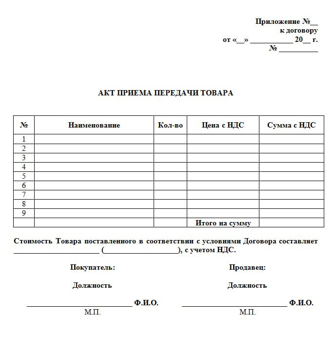
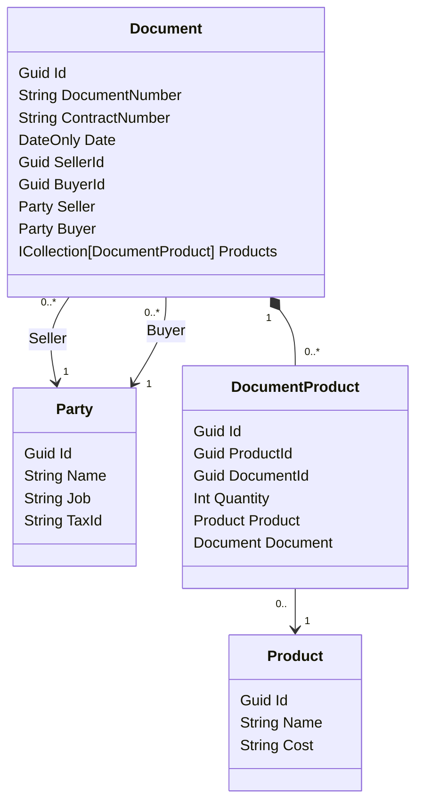

# DocumentGenerator
- ФИО: Иванов Тимофей Михайлович @Karo4a
- Группа: ИП-23-3
- Задание AspNetCore WEB API "Акт приема передачи товаров"

## Акт приёма передачи товаров


## Схема базы данных


## Реализация API
### CRUD товаров
|verb|url|description|request|response|codes|
|-|-|-|-|-|-|
|GET|api/products/|Получает список всех товаров| |`[productApiModel,]`|200 OK|
|GET|api/products/{id}|Получает товар с идентификатором id| fromRoute: id|`productApiModel`|200 OK<br/>404 Not Found|
|POST|api/products/|Добавляет новый товар|fromBody: `productRequestApiModel`|`productApiModel`|200 OK<br/>409 Conflict<br/>422 Unprocessable Entity|
|PUT|api/products/{id}|Редактирует товар с идентификатором id| fromRoute: id <br/>fromBody: `productRequestApiModel`|`productApiModel`|200 OK<br/>404 Not Found<br/>409 Conflict<br/>422 Unprocessable Entity|
|DELETE|api/products/{id}|Удаляет товар с идентификатором id| fromRoute: id| |200 OK<br/>404 Not Found|
```javascript
// productApiModel
{
  id: "3fa85f64-5717-4562-b3fc-2c963f66afa6",
  name: "Товар 1",
  cost: 1
}
```
```javascript
// productRequestApiModel
{
  name: "Товар 1",
  cost: 1
}
```

### CRUD стороны акта
|verb|url|description|request|response|codes|
|-|-|-|-|-|-|
|GET|api/party/|Получает список всех сторон актов| |`[partyApiModel,]`|200 OK|
|GET|api/party/{id}|Получает сторону акта с идентификатором id| fromRoute: id|`partyApiModel`|200 OK<br/>404 Not Found|
|POST|api/party/|Добавляет новую сторону акта| fromBody: `partyRequestApiModel`|`partyApiModel`|200 OK<br/>409 Conflict<br/>422 Unprocessable Entity|
|PUT|api/party/{id}|Редактирует сторону акта с идентификатором id| fromRoute: id <br/>fromBody: `partyRequestApiModel`|`partyApiModel`|200 OK<br/>404 Not Found<br/>409 Conflict<br/>422 Unprocessable Entity|
|DELETE|api/party/{id}|Удаляет сторону акта с идентификатором id| fromRoute: id| |200 OK<br/>404 Not Found|
```javascript
// partyApiModel
{
  id: "3fa85f64-5717-4562-b3fc-2c963f66afa6",
  name: "ФИО стороны акта",
  job: "Работа стороны акта",
  taxId: "1234567891"
}
```
```javascript
// partyRequestApiModel
{
  name: "ФИО стороны акта",
  job: "Работа стороны акта",
  taxId: "1234567891"
}
```

### CRUD документа
|verb|url|description|request|response|codes|
|-|-|-|-|-|-|
|GET|api/document/{id}/export|Экспортирует документ в формате Excel с идентификатором id|fromRoute: id|`file.xlsx`|200 OK<br/>404 Not Found|
|GET|api/document/|Получает список всех документов| |`[documentApiModel,]`|200 OK|
|GET|api/document/{id}|Получает документ с идентификатором id| fromRoute: id|`documentApiModel`|200 OK<br/>404 Not Found|
|POST|api/document/|Добавляет новый документ| fromBody: `documentRequestApiModel`|`documentApiModel`|200 OK<br/>404 Not Found<br/>409 Conflict|
|PUT|api/document/{id}|Редактирует документ с идентификатором id| fromRoute: id <br/>fromBody: `documentRequestApiModel`|`documentApiModel`|200 OK<br/>404 Not Found<br/>409 Conflict<br/>422 Unprocessable Entity|
|DELETE|api/document/{id}|Удаляет документ с идентификатором id| fromRoute: id| |200 OK<br/>404 Not Found|
```javascript
// documentProductApiModel
{
  id: "3fa85f64-5717-4562-b3fc-2c963f66afa6",
  product: {
    id: "3fa85f64-5717-4562-b3fc-2c963f66afa6",
    name: "Товар 1",
    cost: 1
  },
  quantity: 1,
  cost: 1
}
```
```javascript
// documentProductRequestApiModel
{
  productId: "3fa85f64-5717-4562-b3fc-2c963f66afa6",
  quantity: 1,
  cost: 1
}
```
```javascript
// documentApiModel
{
  id: "3fa85f64-5717-4562-b3fc-2c963f66afa6",
  documentNumber: "1",
  contractNumber: "1",
  date: "2025-09-11",
  seller: {
    id: "3fa85f64-5717-4562-b3fc-2c963f66afa6",
    name: "ФИО продавца",
    job: "Работа продавца",
    taxId: "1234567891"
  },
  buyer: {
    id: "3fa85f64-5717-4562-b3fc-2c963f66afa6",
    name: "ФИО покупателя",
    job: "Работа покупателя",
    taxId: "1234567891"
  },
  products: [
    {
      id: "3fa85f64-5717-4562-b3fc-2c963f66afa6",
      product: {
        id: "3fa85f64-5717-4562-b3fc-2c963f66afa6",
        name: "Товар 1",
        cost: 1
      },
      quantity: 1,
      cost: 1
    }
  ]
}
```
```javascript
// documentRequestApiModel
{
  documentNumber: "1",
  contractNumber: "1",
  date: "2025-09-11",
  sellerId: "3fa85f64-5717-4562-b3fc-2c963f66afa6",
  buyerId: "3fa85f64-5717-4562-b3fc-2c963f66afa6",
  products: [
    {
      productId: "3fa85f64-5717-4562-b3fc-2c963f66afa6",
      quantity: 1,
      cost: 1
    }
  ]
}
```