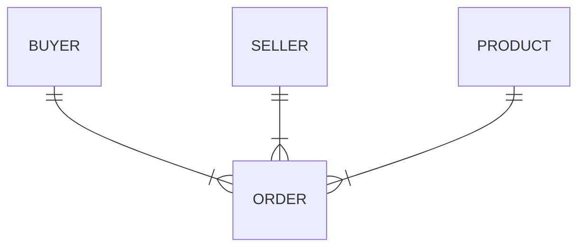

# DocumentGenerator
- ФИО: Иванов Тимофей Михайлович
- Группа: ИП-23-3
- Задание AspNetCore WEB API "Акт приема передачи товаров"
## Схема базы данных


## Реализация API
### CRUD товаров
|verb|url|description|request|response|codes|
|-|-|-|-|-|-|
|GET|api/products/|Получает список всех товаров||`[productApiModel,]`|200 OK|
|GET|api/products/{id}|Получает товар с идентификатором id| fromRoute: id|`productApiModel`|200 OK<br/>404 Not Found|
|POST|api/products/|Добавляет новый товар|`productRequestApiModel`|`productApiModel`|200 OK|
|PUT|api/products/{id}|Обновляет товар с идентификатором id| fromRoute: id <br/>fromBody: `productRequestApiModel`|`productApiModel`|200 OK<br/>404 Not Found|
|DELETE|api/products/{id}|Получает товар с идентификатором id| fromRoute: id|`productApiModel`|200 OK<br/>404 Not Found|
```javascript
// productApiModel
{
  id: 1,
  name: "Товар 1",
  description: "Описание"
}
// productRequestApiModel
```
```javascript
{
  name: "Товар 1",
  description: "Описание"
}
```
