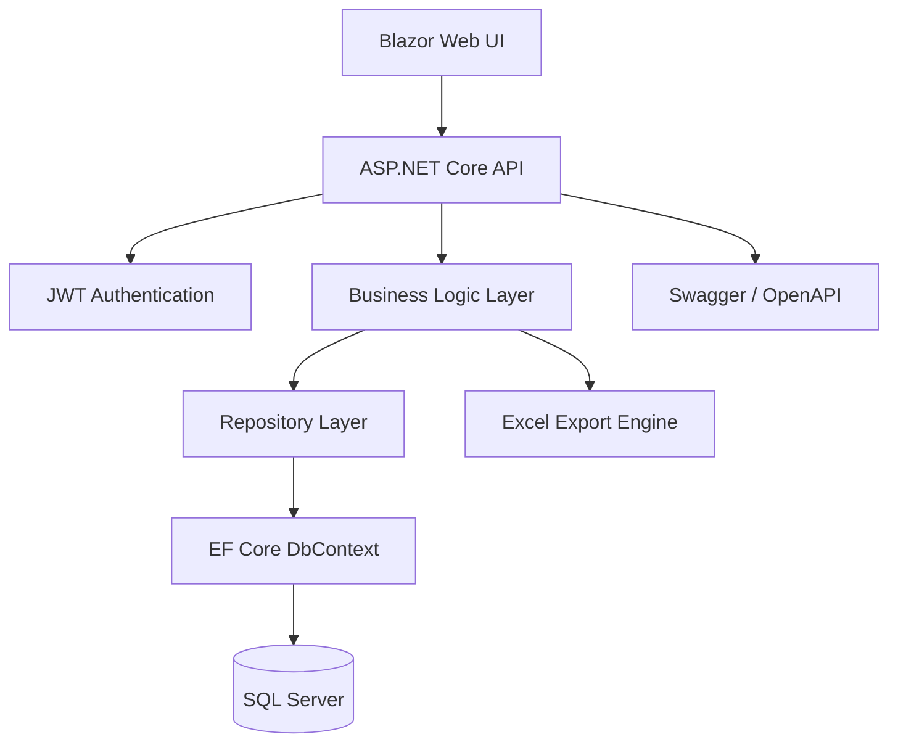
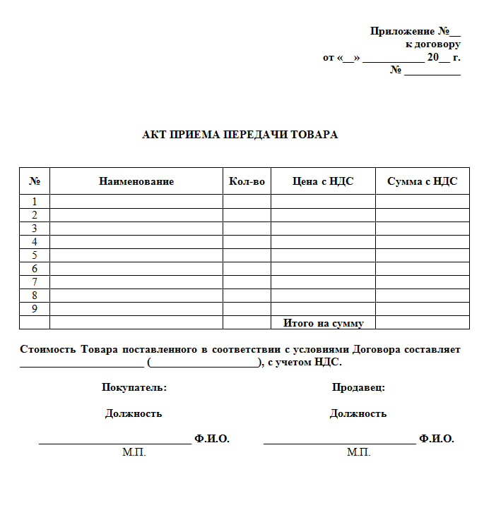
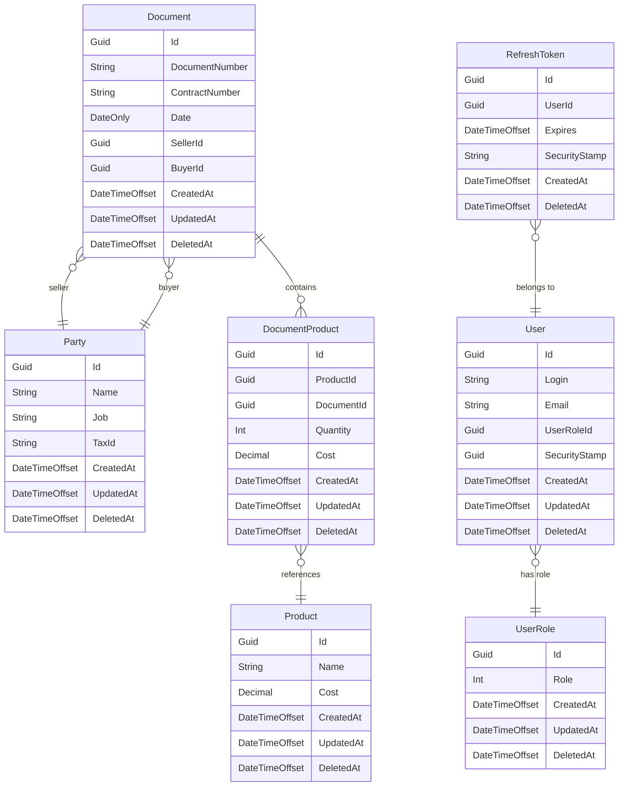

<div align="center">

# DocumentGenerator

**ASP.NET Core 8 Web API** for managing goods transfer-acceptance certificates (акт приёма-передачи товаров) with a Blazor Interactive Server frontend.

[](https://dotnet.microsoft.com/)

</div>

## Contents

- [What is this?](#what-is-this)
- [Architecture](#architecture)
- [Quick Start](#quick-start)
- [Project Structure](#project-structure)
- [API Endpoints](#api-endpoints)
- [Excel Export Example](#excel-export-example)
- [Database Schema](#database-schema)
- [Documentation](#documentation)
- [Tech Stack](#tech-stack)
- [Testing](#testing)
- [License](#license)

## What is this?

A full-stack document management system for creating, managing, and exporting goods transfer-acceptance certificates. The system provides a RESTful API with JWT-authenticated role-based access (Viewer, Editor, Admin) and a Blazor web UI, backed by SQL Server and Entity Framework Core.

**Features:**
- **Products** — CRUD for catalog items with name and cost
- **Parties** — CRUD for seller/buyer entities (name, job title, tax ID)
- **Documents** — CRUD for transfer-acceptance certificates linking products with parties
- **Excel Export** — each document can be exported as a formatted `.xlsx` file
- **Authentication** — JWT-based login with refresh token rotation
- **Role-Based Access** — Viewer (read), Editor (create/edit), Admin (delete/manage users)
- **Blazor UI** — Interactive Server frontend consuming the API
- **Comprehensive Tests** — xUnit + Moq + FluentAssertions across 5 test projects

## Architecture


```mermaid
graph TD
    Client[Blazor Web UI] --> API[ASP.NET Core API]
    API --> Auth[JWT Authentication]
    API --> Services[Business Logic Layer]
    Services --> Repos[Repository Layer]
    Repos --> Context[EF Core DbContext]
    Context --> DB[(SQL Server)]
    Services --> Excel[Excel Export Engine]
    API --> Swagger[Swagger / OpenAPI]
```

## Quick Start

```bash
# Clone the repository
git clone https://github.com/Karo4a/DocumentGenerator.git
cd DocumentGenerator

# Configure the database connection
# Connection string is in DocumentGenerator.Api/appsettings.json (key: "DefaultConnection").
# For EF Core migrations, the same string is hardcoded in
# DocumentGenerator.Context/DocumentGeneratorDesignTimeDbContextFactory.cs.

# Run the API
dotnet run --project DocumentGenerator.Api

# Run the Blazor frontend (in another terminal)
dotnet run --project DocumentGenerator.Web
```

The API will be available with Swagger UI at `/swagger`. Blazor frontend URL is configured in the API's `ApiSettings:BaseUrl` (`DocumentGenerator.Web/appsettings.json`). Ports are defined in `Properties/launchSettings.json` of each project.

## Project Structure

```
DocumentGenerator/
├── DocumentGenerator.Api/                  # ASP.NET Core Web API
│   ├── Controllers/                        # Auth, Document, Party, Product, User
│   ├── Infrastructure/                     # AutoMapper profile, exception filter
│   └── Program.cs
├── DocumentGenerator.Api.Client/           # NSwag-generated HTTP client
├── DocumentGenerator.Api.Models/           # API request/response DTOs
│   ├── Auth/
│   ├── Document/
│   ├── DocumentProduct/
│   ├── Enums/
│   ├── Exceptions/
│   ├── Party/
│   ├── Product/
│   └── User/
├── DocumentGenerator.Api.Tests/            # API integration tests
│   ├── Client/
│   ├── ControllersTests/
│   └── Infrastructure/
├── DocumentGenerator.Common/               # Shared utilities
├── DocumentGenerator.Common.Contracts/     # Shared interfaces
├── DocumentGenerator.Common.Mvc/           # JWT auth & DI extensions
├── DocumentGenerator.Context/              # EF Core DbContext & migrations
│   └── Migrations/
├── DocumentGenerator.Context.Contracts/    # Context interfaces
├── DocumentGenerator.Entities/             # EF Core entity classes
│   └── Enums/
├── DocumentGenerator.Entities.Configurations/  # Fluent API configurations
├── DocumentGenerator.Entities.Contracts/   # Base entity interfaces
├── DocumentGenerator.Entities.Default/     # Seed data
├── DocumentGenerator.Entities.ValidationConstants/  # Validation rules
├── DocumentGenerator.Repositories/         # Read/Write repository implementations
├── DocumentGenerator.Repositories.Contracts/  # Repository interfaces
├── DocumentGenerator.Services/             # Business logic layer
│   ├── Infrastructure/
│   └── Validators/
├── DocumentGenerator.Services.Contracts/   # Service interfaces & models
├── DocumentGenerator.Web/                  # Blazor Interactive Server UI
│   ├── Components/
│   ├── Infrastructure/
│   ├── Services/
│   └── wwwroot/
├── DocumentGenerator.Web.Tests/
├── DocumentGenerator.Context.Tests/
├── DocumentGenerator.Database.Tests/
├── DocumentGenerator.Repositories.Tests/
├── DocumentGenerator.Services.Tests/
└── DocumentGenerator.sln
```

## API Endpoints

### Authentication

| Method | Route | Auth | Description |
|--------|-------|------|-------------|
| POST | `api/Auth/login` | Anonymous | Login — returns JWT + refresh token |
| POST | `api/Auth/refresh` | Anonymous | Refresh access token |
| POST | `api/Auth/logout` | Authorized | Revoke refresh token |

### Users

| Method | Route | Role | Description |
|--------|-------|------|-------------|
| GET | `api/User/me` | Authorized | Get current user info |
| GET | `api/User/{id}` | Admin | Get user by ID |
| GET | `api/User/` | Admin | Get all users |
| POST | `api/User/register` | Anonymous | Register new user |
| PUT | `api/User/{id}/change-role` | Admin | Change user role |
| DELETE | `api/User/{id}` | Admin | Delete user |

### Products

| Method | Route | Role | Description |
|--------|-------|------|-------------|
| GET | `api/Product/{id}` | Viewer+ | Get product by ID |
| GET | `api/Product/` | Viewer+ | Get all products |
| POST | `api/Product/` | Editor+ | Create product |
| PUT | `api/Product/{id}` | Editor+ | Update product |
| DELETE | `api/Product/{id}` | Admin | Delete product |

```json
// ProductApiModel
{
  "id": "3fa85f64-5717-4562-b3fc-2c963f66afa6",
  "name": "Товар 1",
  "cost": 1
}
```

### Parties

| Method | Route | Role | Description |
|--------|-------|------|-------------|
| GET | `api/Party/{id}` | Viewer+ | Get party by ID |
| GET | `api/Party/` | Viewer+ | Get all parties |
| POST | `api/Party/` | Editor+ | Create party |
| PUT | `api/Party/{id}` | Editor+ | Update party |
| DELETE | `api/Party/{id}` | Admin | Delete party |

```json
// PartyApiModel
{
  "id": "3fa85f64-5717-4562-b3fc-2c963f66afa6",
  "name": "ФИО стороны акта",
  "job": "Работа стороны акта",
  "taxId": "1234567891"
}
```

### Documents

| Method | Route | Role | Description |
|--------|-------|------|-------------|
| GET | `api/Document/{id}/export` | Viewer+ | Export document as Excel (.xlsx) |
| GET | `api/Document/{id}` | Viewer+ | Get document by ID |
| GET | `api/Document/` | Viewer+ | Get all documents |
| POST | `api/Document/` | Editor+ | Create document |
| PUT | `api/Document/{id}` | Editor+ | Update document |
| DELETE | `api/Document/{id}` | Admin | Delete document |

```json
// DocumentApiModel
{
  "id": "3fa85f64-5717-4562-b3fc-2c963f66afa6",
  "documentNumber": "1",
  "contractNumber": "1",
  "date": "2025-09-11",
  "seller": { "id": "...", "name": "ФИО продавца", "job": "Работа продавца", "taxId": "1234567891" },
  "buyer": { "id": "...", "name": "ФИО покупателя", "job": "Работа покупателя", "taxId": "1234567891" },
  "products": [
    {
      "id": "...",
      "product": { "id": "...", "name": "Товар 1", "cost": 1 },
      "quantity": 1,
      "cost": 1
    }
  ]
}
```

## Excel Export Example

Each document can be exported as a formatted `.xlsx` file.

```http
GET /api/Document/{id}/export
```

Requires `Viewer`, `Editor`, or `Admin` role. Returns an Excel file named `Акт приёма передачи товара №{DocumentNumber}.xlsx` with content type `application/vnd.openxmlformats-officedocument.spreadsheetml.sheet`.

The generated document includes a title block, a table of products (№, name, quantity, unit price with VAT, total with VAT), summary totals, and buyer/seller signature blocks:



## Database Schema


```mermaid
erDiagram
  Party {
    Guid Id
    String Name
    String Job
    String TaxId
    DateTimeOffset CreatedAt
    DateTimeOffset UpdatedAt
    DateTimeOffset DeletedAt
  }
  Product {
    Guid Id
    String Name
    Decimal Cost
    DateTimeOffset CreatedAt
    DateTimeOffset UpdatedAt
    DateTimeOffset DeletedAt
  }
  DocumentProduct {
    Guid Id
    Guid ProductId
    Guid DocumentId
    Int Quantity
    Decimal Cost
    DateTimeOffset CreatedAt
    DateTimeOffset UpdatedAt
    DateTimeOffset DeletedAt
  }
  Document {
    Guid Id
    String DocumentNumber
    String ContractNumber
    DateOnly Date
    Guid SellerId
    Guid BuyerId
    DateTimeOffset CreatedAt
    DateTimeOffset UpdatedAt
    DateTimeOffset DeletedAt
  }
  User {
    Guid Id
    String Login
    String Email
    Guid UserRoleId
    Guid SecurityStamp
    DateTimeOffset CreatedAt
    DateTimeOffset UpdatedAt
    DateTimeOffset DeletedAt
  }
  UserRole {
    Guid Id
    Int Role
    DateTimeOffset CreatedAt
    DateTimeOffset UpdatedAt
    DateTimeOffset DeletedAt
  }
  RefreshToken {
    Guid Id
    Guid UserId
    DateTimeOffset Expires
    String SecurityStamp
    DateTimeOffset CreatedAt
    DateTimeOffset DeletedAt
  }
  Document }o--|| Party : "seller"
  Document }o--|| Party : "buyer"
  DocumentProduct }o--|| Product : "references"
  Document ||--o{ DocumentProduct : "contains"
  User }o--|| UserRole : "has role"
  RefreshToken }o--|| User : "belongs to"
```

## Documentation

| Resource | Description |
|----------|-------------|
| [AuthController](DocumentGenerator.Api/Controllers/AuthController.cs) | Login, refresh, logout |
| [ProductController](DocumentGenerator.Api/Controllers/ProductController.cs) | Product CRUD |
| [PartyController](DocumentGenerator.Api/Controllers/PartyController.cs) | Party CRUD |
| [DocumentController](DocumentGenerator.Api/Controllers/DocumentController.cs) | Document CRUD + Excel export |
| [UserController](DocumentGenerator.Api/Controllers/UserController.cs) | User management |
| [Services](DocumentGenerator.Services/) | Business logic layer |
| [Repositories](DocumentGenerator.Repositories/) | Data access layer |

## Tech Stack

| Layer | Technology |
|-------|-----------|
| Runtime | .NET 8 |
| API | ASP.NET Core, Swashbuckle (Swagger) |
| ORM | Entity Framework Core 8 (SQL Server) |
| Auth | JWT Bearer (HMAC-SHA256 + AES-256-CBC) |
| Frontend | Blazor Interactive Server + Blazor.Bootstrap |
| Excel | DocumentFormat.OpenXml |
| Mapping | AutoMapper |
| Validation | FluentValidation |
| Testing | xUnit, Moq, FluentAssertions |
| Client | NSwag-generated HTTP client |

## Testing

```bash
dotnet test
```

Five test projects cover the API controllers, services, repositories, database context, and data access layer — all using xUnit, Moq, and FluentAssertions.

> **Note:** Tests are not yet fully adapted to the current authorization system and recent changes.

## License

[MIT](LICENSE) — Copyright &copy; 2025 Karo4a.


